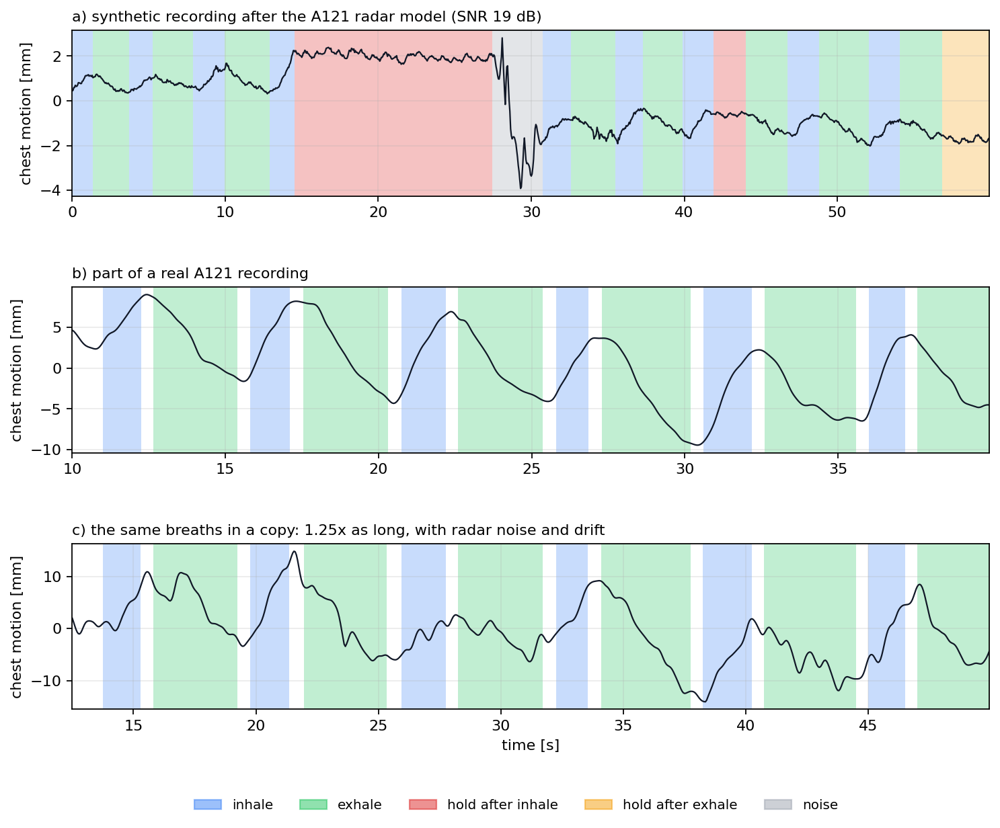

# Rozszerzone dane sztuczne z wcześniejszych nagrań — v2

Wygenerowano 2026-10-06 z tych samych źródeł, z których korzystał wcześniejszy
`tools/build_artificial_data.py`: 19 własnych nagrań A121 oraz 23 nagrania pasa
Szymańskiego. Pliki v1 pozostają zachowane. V2 jest **uzupełnieniem**, zawierającym wyłącznie
nowe augmentacje. Nie wykonano treningu.

## Podziały są tymczasowe

Większość docelowych danych nie jest jeszcze zebrana. Obecny przydział
train/val/test ma jedynie utrzymać techniczny format eksportu i pochodzenie
kopii. Nie jest zamrożonym planem walidacji i testowania ani podstawą do
raportowania końcowej jakości modelu. Builder odziedziczył przydziały v1,
żeby na tym etapie nie zmieniać równocześnie źródeł i podziału.

Po zebraniu danych należy ustalić podział po niezależnych sesjach i docelowym
zakresie osób. Następnie ponownie wybrać bank szumu z treningu i wygenerować
wszystkie kopie oraz okna. Oryginał, jego kopie i szum pozyskany z niego muszą
pozostać po jednej stronie tego podziału. Sama zmiana pola `split` w gotowych
oknach nie usuwa przecieku. Ta sama zasada dotyczy
[nowych oznaczeń bliskiego radaru](../radar_close_v1/README.md).

## Przenoszenie etykiet

Źródłem są **istniejące oznaczenia przebiegu źródłowego**, przed dodaniem
nowego szumu i dryfu. Nie uruchamiamy detektora ani nowego oznaczania na
zniekształconej kopii. Źródło nie jest idealnie czyste: ma swój rzeczywisty
szum, a etykiety mogą mieć błędy. Kopia dziedziczy te ograniczenia.

- Zmiana czasu: interpolacja sygnału i przeniesienie etykiet metodą najbliższej
  próbki po tych samych współrzędnych. Marginesy `IGNORE` także się rozciągają.
- Szum, dryf i modelowe osłabienie echa: etykiety pozostają takie same.
  Krótkie dodatkowe oscylacje od szumu nie są nowymi oddechami.
- Syntetyczne oddechy od zera: etykiety wynikają z generatora, przed modelem
  IQ. Te same 60 przebiegów pozostaje wyłącznie w v1 — v2 ich nie powiela.
  Nie dodawano drugi raz modelu radaru do tych samych syntetycznych sygnałów.

## Co wygenerowano

Z roboczej części treningowej wcześniejszych źródeł:

| Źródło | Liczba kopii | Minuty odziedziczonych etykiet |
|---|---:|---:|
| Własny A121 | 117 (13 źródeł × 9) | 133,9 |
| Pas oddechowy | 96 (16 źródeł × 6) | 398,2 |
| Generator A121 od zera | 0 nowych w v2 | 300,0 pozostaje wyłącznie w v1 |

W każdej serii sześciu kopii: długość ×0,7 / 0,8 / 0,9 / 1,1 / 1,25 / 1,4;
podstawowy szum z prawdziwych pauz o odchyleniu 3–30% zakresu p5–p95;
dodatkowy składnik z wolnozmienną obwiednią ×0,5–1,5, wygładzoną na skali
3 s; losowy dryf z limitem 0,05 / 0,1 / 0,2 / 0,3 / 0,45 / 0,6 zakresu
na minutę. Dodatkowy składnik ma połowę podstawowego poziomu przed modulacją.

Dla A121 ponadto trzy przebiegi przez model IQ z osłabieniem mocy echa
0 / 6 / 12 dB przy stałym poziomie szumu odbiornika, SNR 35 / 29 / 23 dB,
clutter 0,08 i fading 0,15. Przesunięcie klatki nie jest zmniejszane. Model
przyjmuje rzeczywisty przebieg już zawierający własne zakłócenia i jest
przybliżeniem warunków pomiaru. Echo modelowe ma względne jednostki dB.
Nie stosowano tej operacji do pasa: jego jednostki nie są milimetrami.

Bank szumu: 3,0 min pauz wyłącznie z roboczego treningu A121. Wspólne metody:
`enhanced_augment_run` i `reduced_power_run` w
`src/respi_net/artificial_runs.py`. Korzysta z nich także builder bliskiego
radaru, więc oba procesy nie mają osobnych implementacji tych dodatków.



## Pliki

Pełne pliki lokalne, zgodnie z dotychczasową polityką ignorowania danych
pochodnych w Git:

```text
data/processed/breath_phases/enhanced_v2/
  dataset_finetune_v2.npz    # tylko nowe rozszerzone kopie własnego radaru
  dataset_pretrain_v2.npz    # tylko nowe rozszerzone kopie pasa
  dataset_finetune_v1_plus_v2.npz  # v1 + dodatki, kontrola duplikatów
  dataset_pretrain_v1_plus_v2.npz  # v1 + dodatki, kontrola duplikatów
  artificial_summary.json
  copies/*.npz             # 213 kopii z etykietami, metadanymi i grupą źródła
```

W Git zapisano [podsumowanie](summary.json), wykres i `samples/`: jedno własne
źródło radaru oraz jego kopie ×0,7, ×1,4 i z osłabieniem echa 12 dB.
Zmodyfikowane dane pasa pozostają lokalne (CC BY-NC-ND).

Odtworzenie po przygotowaniu lokalnych źródeł jak dla v1:

```sh
uv run --offline python tools/build_artificial_data.py --enhanced \
  --summary-path docs/datasets/artificial_v2/summary.json \
  --notes-figure docs/datasets/artificial_v2/examples.png \
  --own-examples-dir docs/datasets/artificial_v2/samples
```

Seed główny: 0. Rozszerzone kopie używają niezależnych seedów 20261006
(A121) i 20261007 (pas); generator od zera zachowuje strumień losowy v1.
Okna mają 60 s, krok 10 s i 20 s kontekstu bez celów uczenia.

## V1 i v2: suma, a nie zamiana

Wcześniejszy eksport v2 zawierał całą bazę i te same 60 przebiegów
syntetycznych co v1. Poprawiono builder: v2 zapisuje teraz wyłącznie 213
nowych kopii. Dotychczasowe bazowe nagrania, sześć starszych wariantów
augmentacji i generator pozostają w v1. Nowe kopie mają końcówkę
`__enhanced_v2`, więc podobne współczynniki tempa nie powodują kolizji nazw.
Ich szum i dryf są inne, zatem nie są identycznymi kopiami starej augmentacji.

Do wykorzystania obu metod służą pliki `*_v1_plus_v2.npz`. Builder porównuje
zawartość każdego okna (sygnał i etykiety) i zapisuje identyczne okna tylko
raz. Konflikt podziału dla tej samej grupy źródłowej albo identycznych okien
powoduje błąd. Same dodatki v2 mają wyłącznie roboczy przydział train;
val/test pochodzą z v1 w pliku połączonym. Końcowy podział nadal wymaga
ponownego ustalenia po zebraniu danych.

Do uczenia wybierz połączony plik albo zestaw v1 i dodatków v2. Nie dodawaj
v1 ani v2 ponownie obok pliku połączonego. W aktualnym eksporcie dodatki mają
455 okien A121 i 1861 okien pasa; suma daje odpowiednio 806/12/12 oraz
5522/72/58 okien w roboczym train/val/test. Kontrola zawartości potwierdziła
brak identycznych okien między zachowanymi v1 a nowymi dodatkami.

Wyświetlane wyżej źródło i przebieg od zera służą porównaniu na wykresie;
nie są dodatkowo dołączane do eksportu v2. W `samples/source.npz` pozostaje
mały przykład bazowy do inspekcji, a nie kolejny zbiór treningowy.
