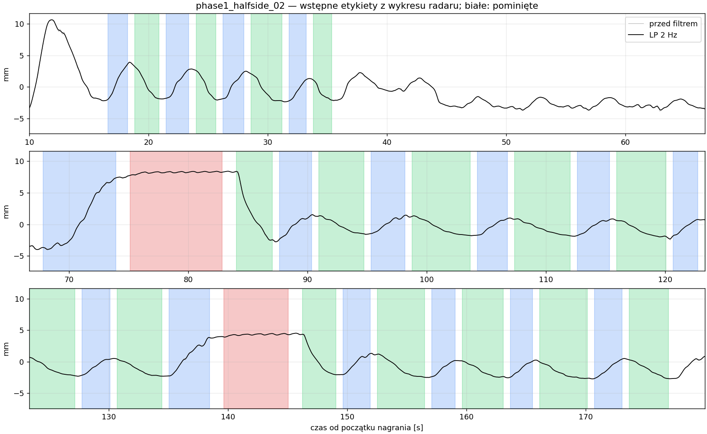
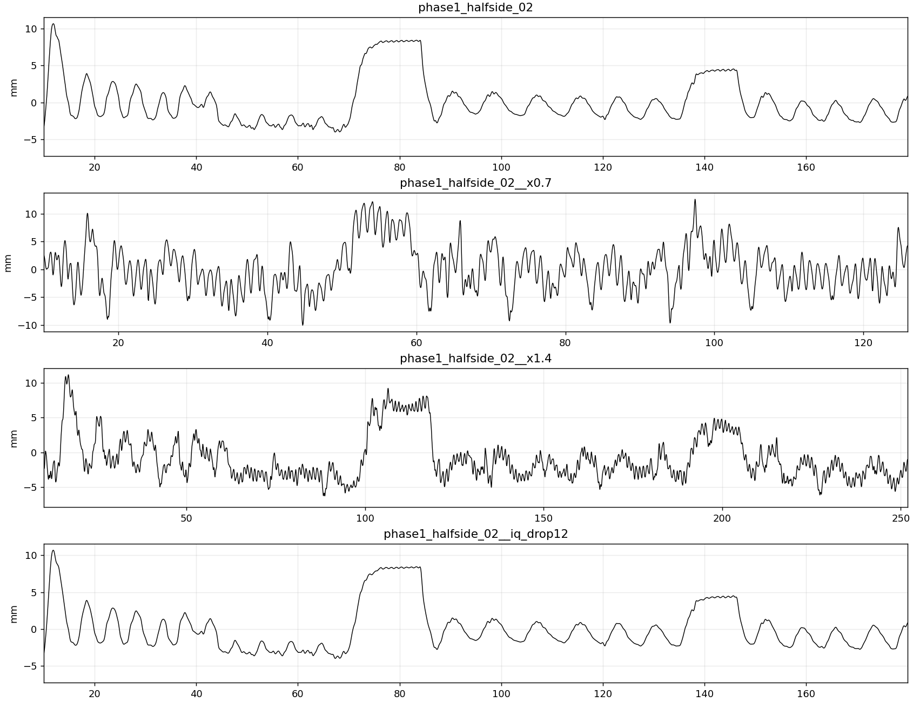

# Ręcznie wybrane etykiety bliskich nagrań radaru — v1

Przygotowano 2026-10-06. Etykiety wyznaczono po wizualnej ocenie przebiegów
radaru; propozycje zwrotów z filtra 0,7 Hz służyły jako pomoc i zostały
przejrzane. Oznaczający: `codex_visual_review`, nie człowiek ani niezależny
pomiar fizjologiczny. Nie wykorzystano etykiet IMU. Są to **wstępne etykiety
sygnału**, do dalszego przeglądu i docelowo sprawdzenia z pasem.

## Zawartość

Edytowalne przedziały: `annotations/radar_close_v1/*.json`. Klasy: 0 wydech,
1 pauza po wydechu, 2 wdech, 3 pauza po wdechu, 4 szum; −1 pominięte.
Początek przedziału jest włączony, koniec wyłączony, czas liczony od początku
pomiaru. Poza zaznaczonymi przedziałami wszystko pozostaje bez etykiety.

| Nagranie | Podział | Oznaczony czas po maskowaniu | Uwagi |
|---|---|---:|---|
| `phase1_halfside_02` | train | 106,30 s | Czytelne cykle i dwie celowe pauzy po wdechu; pominięty słabszy fragment 35,64–67,49 s. |
| `pilot_coach_1m` | train | 61,50 s | Czytelne cykle i długa pauza po wydechu; komendy wspierają interpretację pauzy. |
| `self_lying_3min_01` | val | 57,10 s | Wybrane oddechy; pozorne plateau pominięte, bo notatki mówią o braku celowych pauz. |
| `sit_nophone_01` | test | 47,65 s | Telefon poza ciałem i wiązką; rodzaje pauz wspierają komendy; widoczny dryf pozostaje ograniczeniem. |

Razem **272,55 s (4,54 min)**. Zapas wokół granicy fazy: ±0,3 s; wokół
granic pauzy: ±0,6 s. Marginesy oznaczają niepewność przyjętą w tej wersji,
nie zmierzony błąd czasu. Nie oznaczono klasy szumu. To mały zbiór pilotażowy,
nie kompletny materiał do oceny modelu pięcioklasowego.

Wykresy obok tego pliku: niebieski wdech, zielony wydech, czerwony pauza po
wdechu, żółty pauza po wydechu, białe pominięte. Szary przebieg: fazowe
przesunięcie przed filtrem LP, po odjęciu trendu liniowego; czarny: LP 2 Hz.



## Próbki sztuczne i wcześniejszy proces

Wcześniejszy `tools/build_artificial_data.py` tworzy sześć kopii nagrania
treningowego z długością ×0,7 / 0,8 / 0,9 / 1,1 / 1,25 / 1,4. Sygnał jest
interpolowany, etykiety przenoszone po tych samych współrzędnych. Dodaje szum
z prawdziwych pauz radaru, o odchyleniu 3–30% zakresu p5–p95 sygnału, i wolny
dryf losowy, maksymalnie 0,3 tego zakresu na minutę. Bank szumu pochodzi
wyłącznie z treningu. Osobno generuje od zera oddechy, pauzy, westchnienia,
tętno i ruch, a następnie modeluje A121: fazę IQ, clutter, fading i szum.

Nowa paczka wykorzystuje istniejące `augment_run`, `noise_bank_from_holds`,
`a121_forward` i `displacement_from_iq`; wspólne funkcje nie zostały zmienione.
Z dwóch nagrań treningowych powstało **18 kopii**, z 25,59 min odziedziczonych
etykiet po maskowaniu (to nie jest 25,59 min nowych pomiarów):

- 12 kopii ze starymi współczynnikami czasu i zakresem szumu, z dryfem
  zmienionym między kopiami: 0,05 / 0,1 / 0,2 / 0,3 / 0,45 / 0,6 zakresu
  p5–p95 na minutę. Dryf zmienia kierunek i nachylenie w czasie, jak wcześniej.
- Nowość: dodatkowy składnik prawdziwego szumu z pauz, z wolnozmienną obwiednią
  ×0,5–1,5, wygładzoną na skali 3 s. Podane 3–30% opisuje podstawowy składnik;
  dodatkowy składnik ma połowę tego poziomu przed modulacją. To warianty
  obciążające metodę, a nie nowe potwierdzone warunki pomiaru.
- 6 kopii istniejących przebiegów przez model IQ: obniżenie mocy echa o
  0 / 6 / 12 dB przy stałym szumie odbiornika, SNR 35 / 29 / 23 dB, clutter
  0,08 i fading 0,15. Mniejsza moc echa nie jest mniejszym ruchem klatki.
  Kanał echo tych kopii jest względny i modelowy, nie skalibrowany jak realny.
  Źródłowy przebieg ma już własny szum i dryf; model jest przybliżeniem.

Nie generowano kolejnej paczki oddechów od zera. Wszystkie nowe kopie mają
pochodzenie w konkretnym nagraniu. Etykiety i ich niepewność przechodzą do
kopii; augmentacja nie potwierdza poprawności oznaczeń.



## Zapis, odtwarzanie i wykorzystanie

`annotations/radar_close_v1/sources/` zawiera niewielkie NPZ z czasem,
przesunięciem przed/po filtrze i echem oraz SHA256 źródłowego CSV. Dzięki temu
paczka działa też bez dużych lokalnych plików IQ. Jeśli surowy plik jest
dostępny, jego hash musi zgadzać się ze snapshotem. Pełny IQ pozostaje
ignorowany przez Git zgodnie z istniejącą polityką repo.

`annotations/radar_close_v1/generated/` zawiera 4 rzeczywiste przebiegi,
18 kopii, podsumowanie i `dataset_manual_radar_v1.npz` w istniejącym formacie
sieci: 60 s okna, krok 10 s, pierwsze 20 s jako kontekst bez celów uczenia,
normalizacja przyczynowa z poprzednich 30 s. Okna nakładają się, więc ich
liczba nie jest liczbą niezależnych prób: **156 train, 6 val, 2 test**.

Każda kopia zachowuje grupę źródła. Walidacja i test zawierają tylko prawdziwe
przebiegi i nie dostarczają szumu treningowego. Podział jest po nagraniach,
nie po osobach (wszystko od jednej osoby), i nie dowodzi generalizacji.
Ocena na tych etykietach będzie oceną zgodności z interpretacją wykresu;
potwierdzenie faz fizjologicznych wymaga niezależnego odniesienia. W val brak
pauz, a w całym zbiorze brak klasy szumu — potrzebne są dalsze nagrania.

Odtworzenie:

```sh
uv run --offline python tools/build_manual_radar_data.py
uv run --offline pytest -q tests/test_manual_radar_data.py tests/test_artificial_runs.py tests/test_breath_synth.py tests/test_breath_phase_dataset.py
```

Seed: 20261006. Nie wykonano treningu sieci. Nowe warianty można później
zastosować do wcześniejszych danych przez wspólny builder; ta paczka nie
zmienia wcześniejszych eksportów ani danych pasa.
